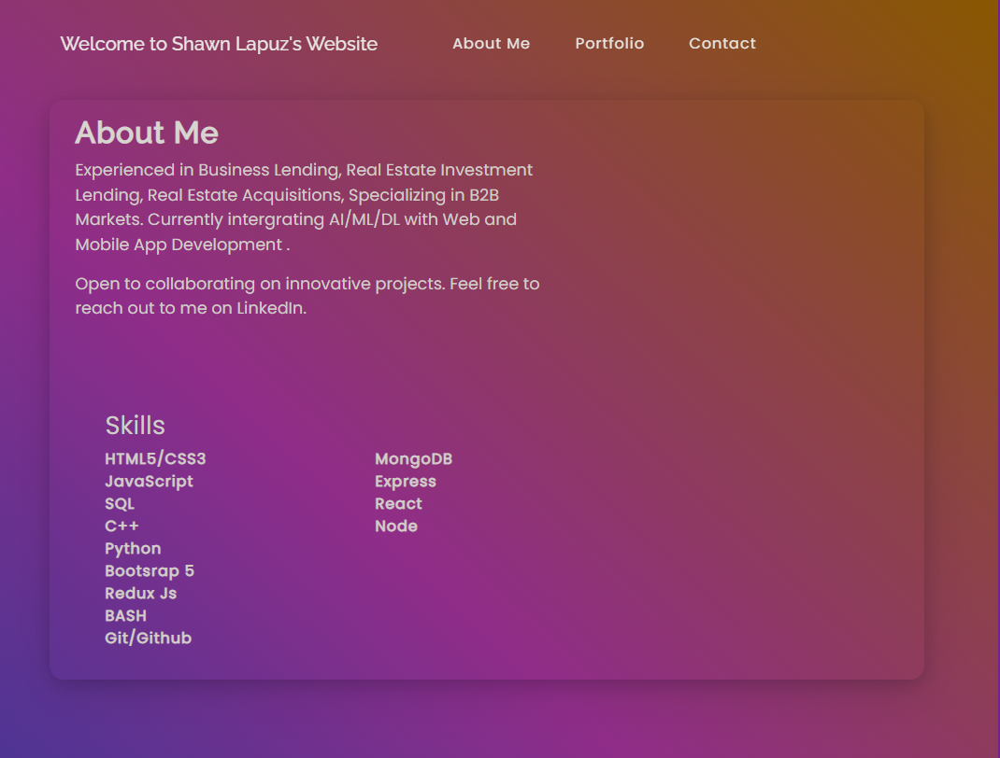
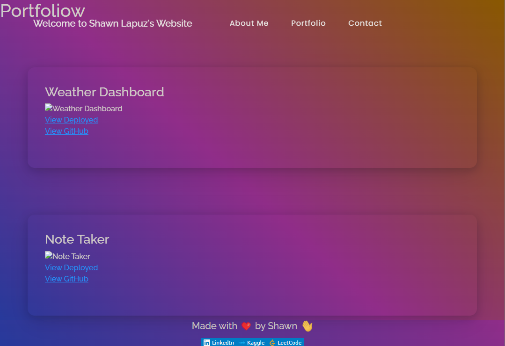
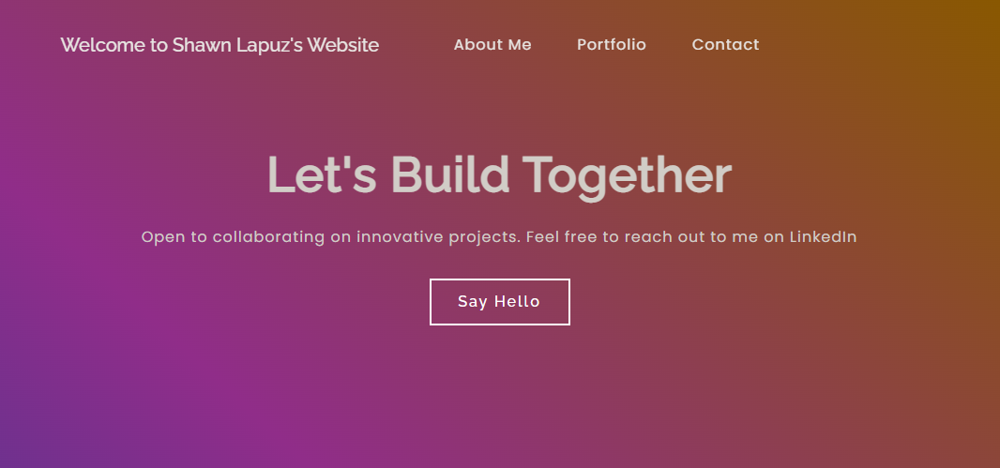

# 20 React: React Portfolio

## Description

Welcome to my vibrant web development portfolio! 
As a web developer, I believe in embracing the power of community and showcasing my skills through the colorful world of React.

Inside this virtual hub, you'll discover three pages: "About Me," "My Projects," and a handy "Contact Me" section. 
(Just a heads-up, I've decided to keep my resume page hush-hush for privacy reasons. Gotta protect those top-secret skills, you know?)

If you're curious about my public links, you can find them gracefully lounging in the footer. 
Feel free to slide into my LinkedIn DMs! Let's connect and make some web magic together.

What are you waiting for? Dive in and explore!


## Table of Contents 

  - [Description](#description)
  - [Table of Contents](#table-of-contents)
  - [Installation](#installation)
  - [Mock-up](#mock-up)
  - [License](#license)
  
  
## Installation
```
npm i

npm run build

npm start

```

## Acceptance Criteria

```
On a single-page application portfolio for a web developer

I am presented with a page containing a header, a section for content, and a footer when I load the portfolio

I am presented with the developer's name and navigation with titles corresponding to different sections of the portfolio when I view the header

I am presented with the titles About Me, Portfolio, Contact, and Resume, and the title corresponding to the current section is highlighted when I view the navigation titles

I am presented with text or icon links to the developer’s GitHub and LinkedIn profiles, and their profile on a third platform (Stack Overflow, Twitter) when I view the footer

```


## Mock-Up






## License 

[](https://opensource.org/licenses/MIT)
